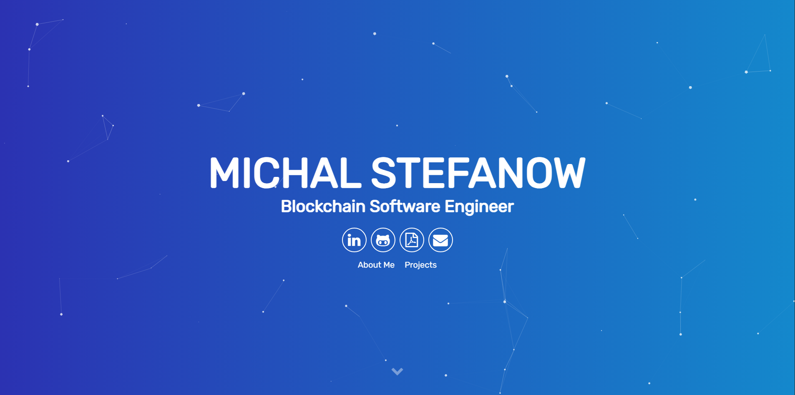

# <a href="https://people.umass.edu/avsingh" target="_blank">My Alternate Portfolio Website</a>

 
A highly skilled Full Stack Engineer with deep expertise in blockchain and DeFi systems, currently focused on Bitcoin protocols including PSBTs, DLCs, Tapscript, and Multisigs. Specialized in building secure, scalable, and high-performance backend architectures. Proven track record of delivering innovative solutions and collaborating effectively with cross-functional teams to advance blockchain technology.

Please hit me up at michalstefanow.marek@gmail.com if you have a plan to work with me. Any request is welcome.
